# Dependency graph — July 2026 quality review issues

Legend: **solid arrow = hard blocker** (do not start the dependent until the blocker lands). **dashed = soft ordering** (both can proceed, but this order is cheaper/cleaner). "coordinate" pairs touch the same files or share a design decision — land together or sequence deliberately; they are listed in each issue body and MANIFEST.json.

```mermaid
graph TD
    subgraph "Hard blockers"
        P1-12["P1-12 border line_height fix"] --> P1-22["P1-22 dual-pipeline consolidation (epic)"]
        P0-06["P0-06 metric_cache lock redesign"] --> P2-36["P2-36 projection perf bundle (epic)"]
        P2-38["P2-38 grapheme_chad API gaps"] --> P2-40u["P2-40: unicode-segmentation removal item"]
        P2-43["P2-43 baumhard seam hygiene"] --> P2-40c["P2-40: crossbeam-channel removal item"]
    end

    subgraph "Soft ordering (dashed)"
        P0-02["P0-02 sync-back gap"] -.-> P0-03["P0-03 animation double-apply"]
        P1-25["P1-25 validation SSOT"] -.-> P1-14["P1-14 verify↔spec drift"]
        P1-26["P1-26 setter fan-out (epic)"] -.-> P1-15["P1-15 palette wiring"]
        P1-17["P1-17 IME insertion primitive"] -.-> P1-30["P1-30 editors+throttle (epic)"]
        P1-10["P1-10 mutation-surface completeness"] -.-> P1-24["P1-24 area/model twins (epic)"]
        P1-28["P1-28 console resolver dedup"] -.-> P1-27["P1-27 console verb framework (epic)"]
        P1-29["P1-29 native/WASM cores (epic)"] -.-> P1-35["P1-35 touch vocabulary (epic)"]
        P1-23["P1-23 O(N²) model walks (epic)"] -.-> P2-36
        P1-23 -.-> P2-37["P2-37 rebuild tiers"]
        P1-30 -.-> P2-37
        P1-22 -.-> P2-41["P2-41 dead-code sweep (epic)"]
        P2-41 -.-> P2-46["P2-46 constants SSOT"]
        P2-47["P2-47 model serde + SectionRange"] -.-> P3-50["P3-50 CONCEPTS sweep"]
        P2-47 -.-> P3-51["P3-51 format/convention docs"]
        P1-14 -.-> P3-51
        P3-50 -.-> P3-53["P3-53 American English sweep (epic)"]
        P3-51 -.-> P3-53
        P3-52["P3-52 doc-corruption sweep"] -.-> P3-53
    end
```

## Fully independent (start any time, in any order)

P0-01, P0-04, P0-05, P0-07, P1-08, P1-09, P1-11, P1-13, P1-16, P1-18, P1-19, P1-20, P1-21, P1-31, P1-32, P1-33, P1-34, P2-39, P2-42, P2-44, P2-45, P2-48, P2-49, P3-52.

## Coordinate-with pairs (same files / shared decision — not blockers)

| Pair | Why |
|---|---|
| P0-02 ⇄ P1-19 | both edit `custom_mutation` apply gating; P0-02's changed-verdict plumbing is what P1-19's no-op path should reuse |
| P0-06 ⇄ P2-36 item 3 | same file (`metric_cache.rs`); key-shape change rides the lock redesign |
| P1-08 ⇄ P2-42 | the two 1970s `is_some()/unwrap()` walker loops are modernized by either — don't collide |
| P1-14 ⇄ P1-25 | P1-14's node-ceiling item consumes P1-25's shared constants |
| P1-22 ⇄ P2-41 | flat-pipeline deletions belong to P1-22 step 1; P2-41 owns everything else dead |
| P1-22 step 3 ⇄ P2-36 item 6 | label-path reuse falls out of moving couriers home |
| P1-29 ⇄ P1-31 | the WASM wheel funnel-bypass appears in both; P1-29 owns the fix, P1-31 references |
| P1-29 ⇄ P1-35 | both extract `drive_touch_event`; extract once |
| P1-30 ⇄ P1-31-C | threading `clean` into the unified single-line editor |
| P1-26 ⇄ P2-48 item 7 | run-less-section defaults use P1-26's `default_text_run` |
| P2-44 ⇄ P3-53 | bench-ID renames are §B8 two-file changes — same commit |
| P2-40 ⇄ P2-41 | dead deps vs dead code: get_some_font/rand, env_logger placement decided once |

## Human-decision gates (small diffs; need a maintainer call before an agent runs)

- **P2-45**: release logging — Option A (`release_max_level_warn`) vs Option B (document the silence).
- **P2-47-C**: which meaning `SelectionState::SectionRange.range` keeps (grapheme vs section-span).
- **P1-15**: wire palettes (option a, recommended) vs re-document as dormant (option b).
- **P2-43-C**: wire the §B6 region-index maintenance vs rewrite §B6 to match reality.

## Suggested waves

1. **Safety** (parallel-friendly): P0-01…07 → P1-08/09/10/11, P1-20, P2-42(items 1-2).
2. **Enablers**: P1-12 (unblocks P1-22), P1-23 (makes every rebuild cheap), P1-25, P1-17, P2-43.
3. **Consolidations**: P1-22, P1-24, P1-26, P1-27+28, P1-29, P1-30, P2-40, P2-41, P2-49.
4. **Perf + hardening**: P1-33, P1-34, P2-36, P2-37, P2-38, P2-39, P2-44, P2-46, P2-47, P2-48, P1-32, P1-35, P1-13, P1-14, P1-15, P1-16, P1-18, P1-19, P1-21.
5. **Docs last** (so they document the settled state): P3-50, P3-51, P3-52, then P3-53.
